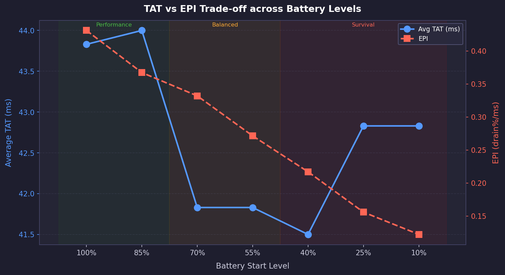
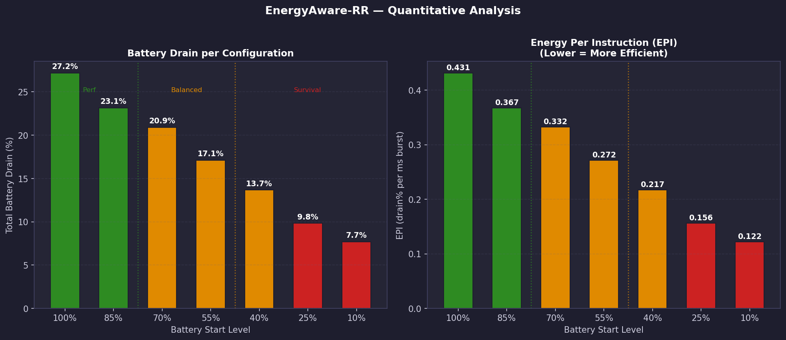
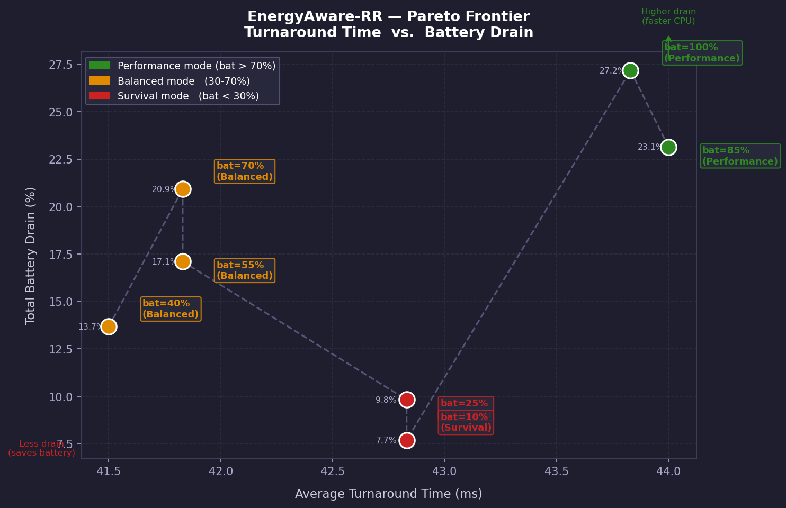

# EnergyAware-RR

**Battery-State-Driven Round Robin CPU Scheduler Simulator**

A **C-based CPU scheduling simulator** that extends the traditional Round Robin scheduling algorithm using **Battery-State-Driven Scheduling** and **Dynamic Voltage and Frequency Scaling (DVFS)**. The project also generates **Python-based Pareto trade-off graphs** to analyze the relationship between scheduling performance and energy efficiency.

---

## Features

- Traditional Round Robin CPU Scheduling
- Battery-State-Driven Scheduling
- Dynamic Voltage and Frequency Scaling (DVFS)
- Performance, Balanced, and Survival Operating Modes
- Waiting Time Analysis
- Turnaround Time Analysis
- Battery Drain Analysis
- Energy Per Instruction (EPI) Analysis
- Pareto Trade-off Analysis
- Automatic Graph Generation using Python

---

## Project Structure

```text
EnergyAware-RR/
│
├── data/
│   ├── analysis_charts.png
│   ├── tat_vs_epi.png
│   ├── pareto_curve.png
│   ├── schedule_log.csv
│   └── pareto.csv
│
├── include/
├── src/
├── Makefile
├── energyaware
├── plot_pareto.py
└── README.md
```

---

## Requirements

- GCC Compiler
- GNU Make
- Python 3
- Matplotlib

---

## Build

Compile the project:

```bash
make
```

---

## Run

Execute the simulator:

```bash
./energyaware
```

Generate the analysis graphs:

```bash
python3 plot_pareto.py
```

---

## Generated Outputs

The simulator generates the following outputs:

- Waiting Time Analysis
- Turnaround Time Analysis
- Battery Drain Analysis
- Energy Per Instruction (EPI)
- Pareto Trade-off Analysis
- CSV Output Files
- Performance Graphs

### TAT vs EPI Trade-off

<p align="center">

</p>

---

### Quantitative Analysis

<p align="center">

</p>

---

### Pareto Frontier

<p align="center">

</p>

---

## Technologies Used

- C
- Python
- GNU Make
- Matplotlib
- Linux

---

## Author

**Parvez Mosharaf**

Department of Computer Science and Engineering

Rangamati Science and Technology University

GitHub: https://github.com/parvezmosharaf0

---

## Project Description

EnergyAware-RR demonstrates how an adaptive Round Robin scheduler can improve energy efficiency by dynamically adjusting scheduling behavior according to battery level while maintaining acceptable scheduling performance. The generated graphs help visualize the trade-off between turnaround time, battery drain, and energy efficiency across different operating modes.
